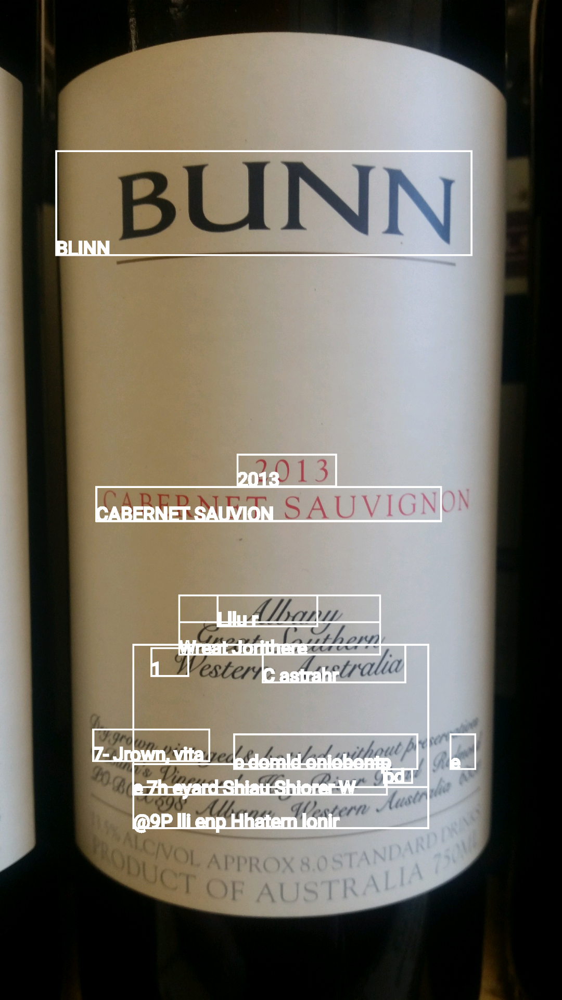
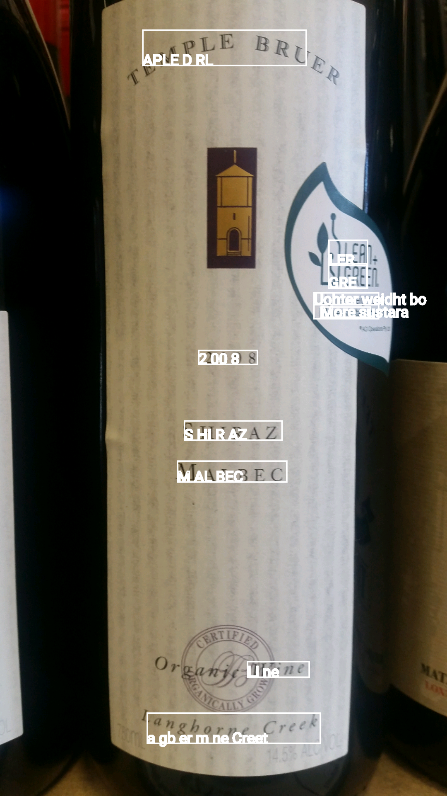
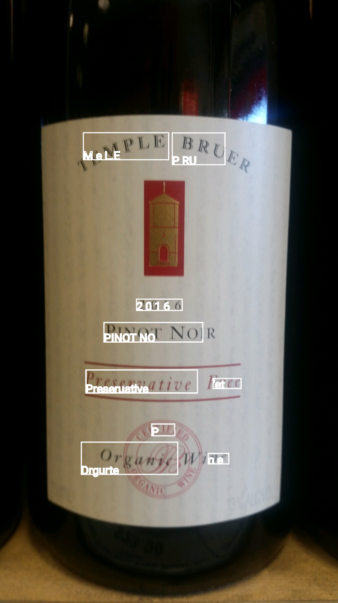
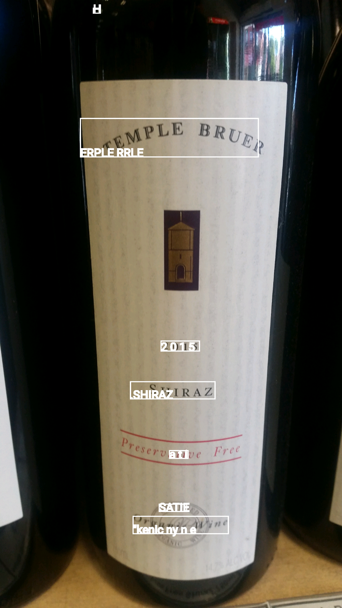

#BaselineReader

This just uses the Google mobile vision text reading library in its out-of-the-box format. This is just so that I can have a baseline with which to see what the efficiency of it is, and to compare future improvements to it.

To make life easier for myself, I'm going to simply read in images I've already taken using my phone, so that I can make sure that any improvements are due to changes in code, rather that me happening to take a better photo. I'll  use a range of different labels of varying simplicity for reading.

  

  

  
