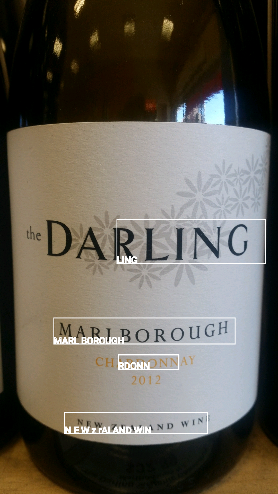
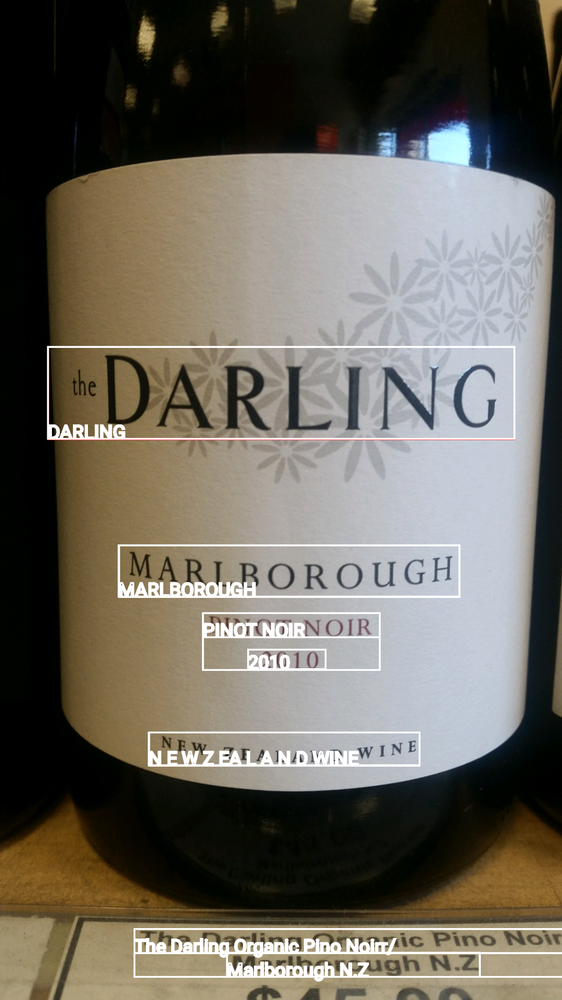
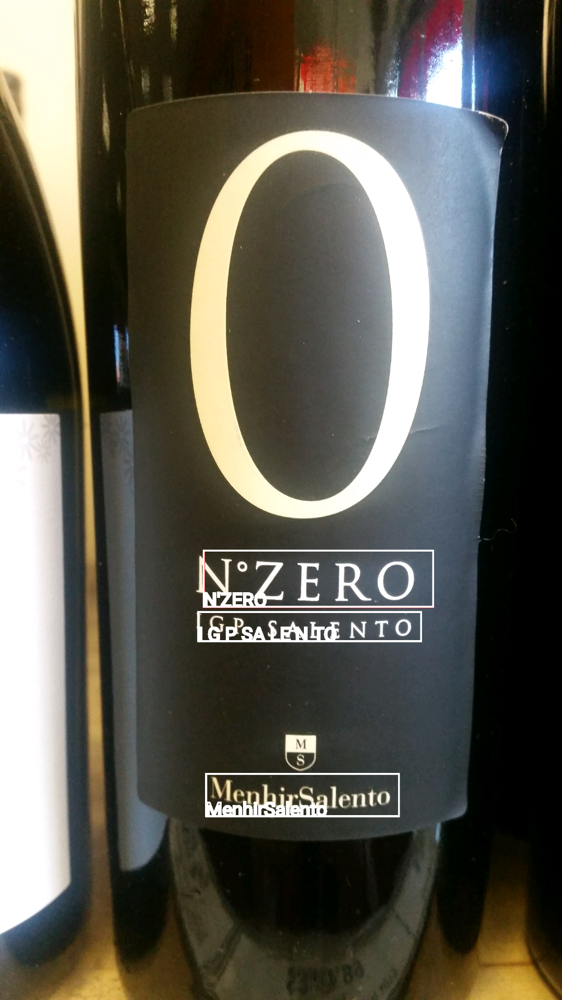
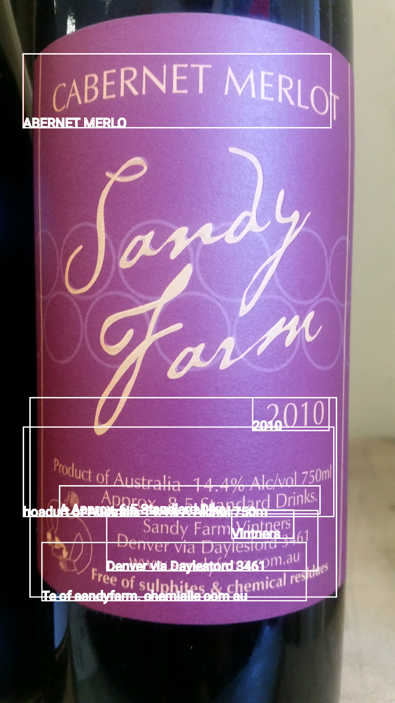

#BaselineReader

This just uses the Google mobile vision text reading library in its out-of-the-box format. This is just so that I can have a baseline with which to see what the efficiency of it is, and to compare future improvements to it.

To make life easier for myself, I'm going to simply read in images I've already taken using my phone, so that I can make sure that any improvements are due to changes in code, rather that me happening to take a better photo. I'll  use a range of different labels of varying simplicity for reading.

  

  

  

  

  

  

Okay, so some inital thoughts on the images above:

- It does a decent job on the simple black writing on a white background
 - This is in line with it's ability to read text from, say, a book
- It does a decent job or reading white writing on a blackbackground 
- It doesn't do well with gold on black writing
- It doesn't do well on 'fancy' (i.e. cursive) writing
 - It completely fails on properly stylised writing (e.g. the Sandy Farm main header)
- It fails completely to read curved writing (e.g. the top Temple Bruer header)
- It doesn't do well when there is a slight gradient in the background (e.g. a shadow gradient)
