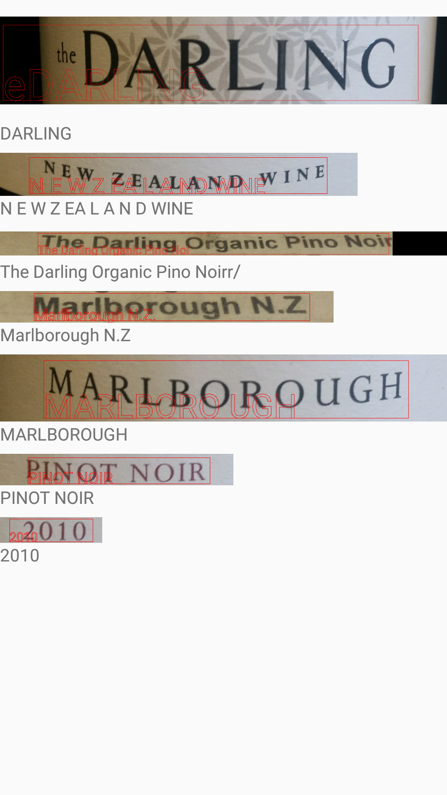
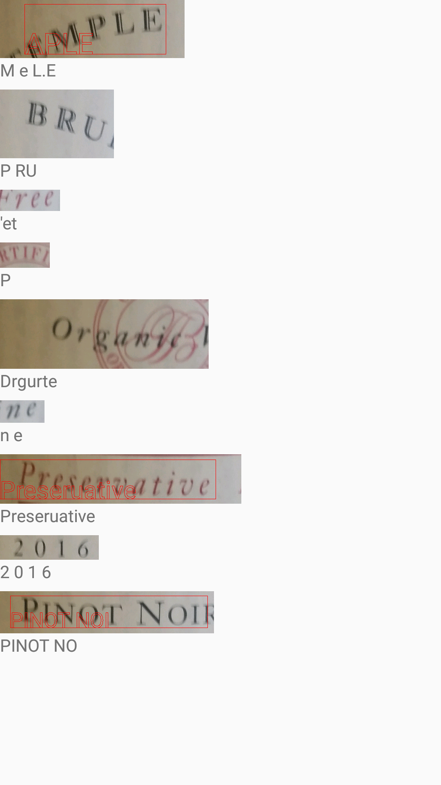

#Reader 1

While I've had some experience using machine vision software, I've always had much more control over the creation of the neural network itself, as well as the training data and methods. So I wanted to get a feel for how this new software worked, and what some of the rules of thumb might be. For example, normally (at least as far as I've experienced it), the easier it is for a human to read something, the easier it is for a machine to read it too.

So my first try at improving the text rader, was to simply find all of the text boxes (using out-of-the-box methods), crop the image to only include each one of them in turn (plus a small margin to not have the text be on the very edge of the image), and have the software rerun a text search on each cropped image. My thinking was that it's easier for a human to read a word if an image only has that word in it, without any extra distractions.

As it turns out, Google's text reader actually performed better when given the whole picture, rather than cropped images of individual words / phrases. I've put some examples below:

  

  

 

The writing below the images are the writing that TextReader first reads, before the image is cropped. The red (or white) writing on the images show the new writing TextReader puls out of the images. A number of times, it doesn't even recognise that here is text in the cropped images.

This looks like a nope.
